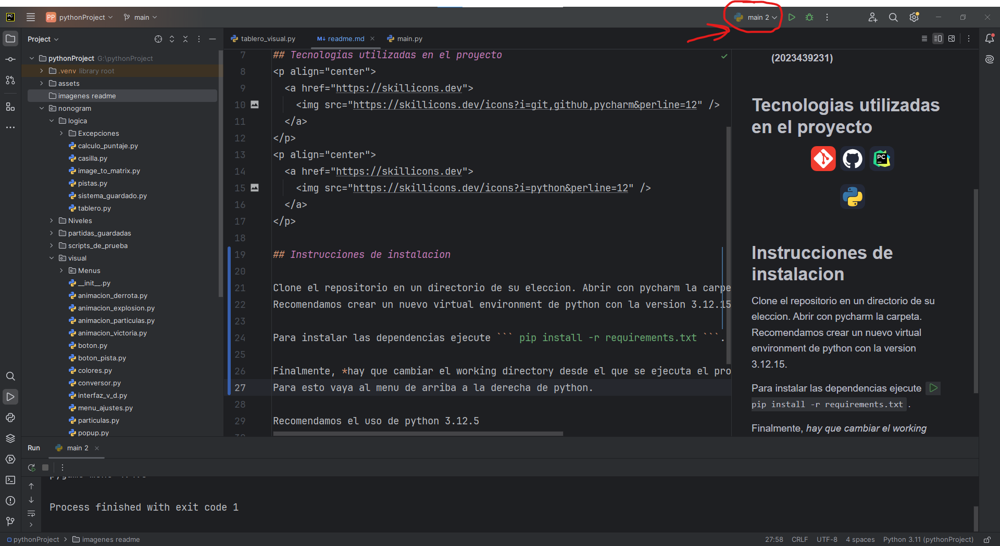
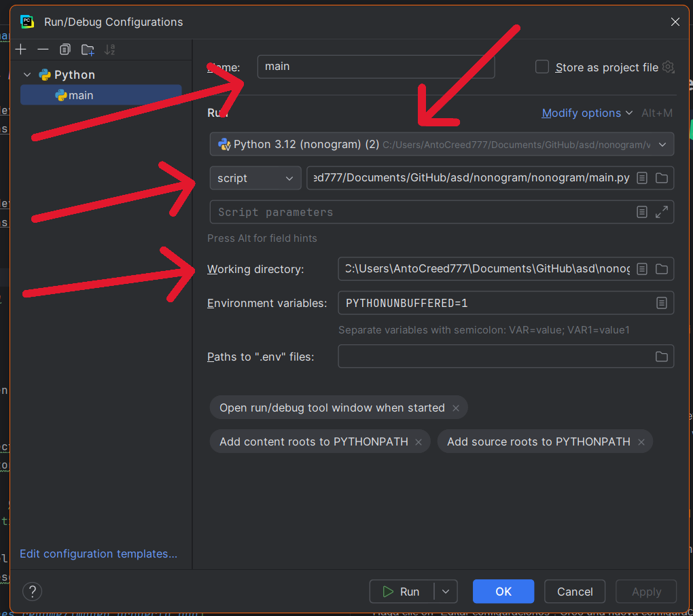
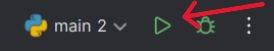
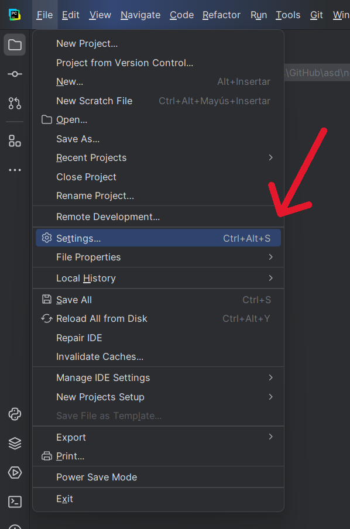
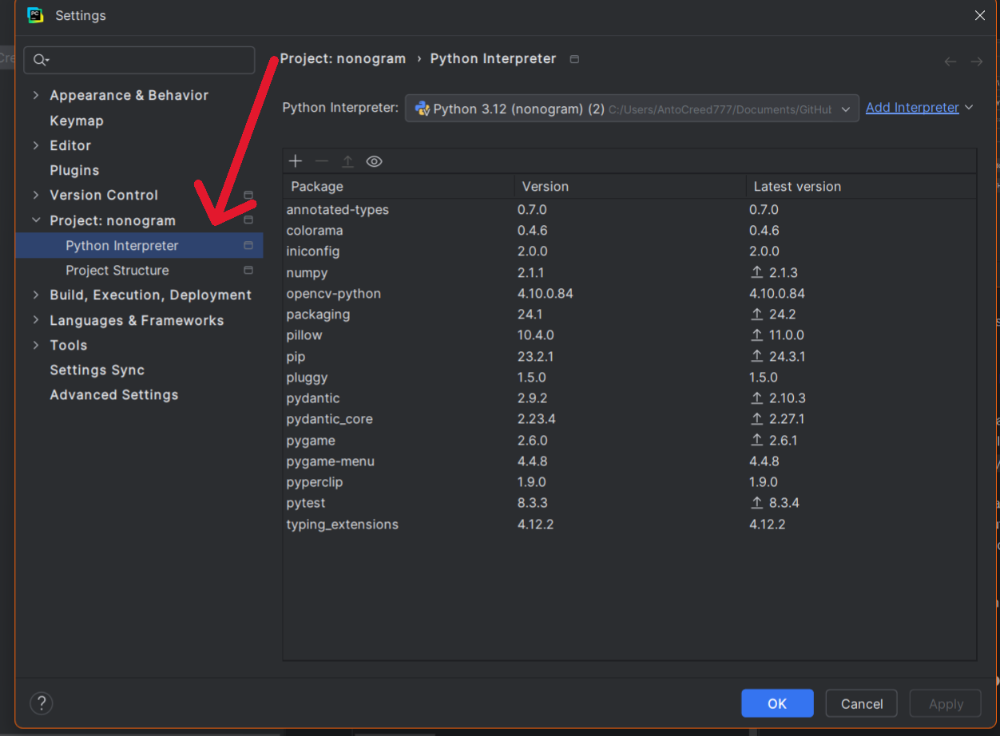
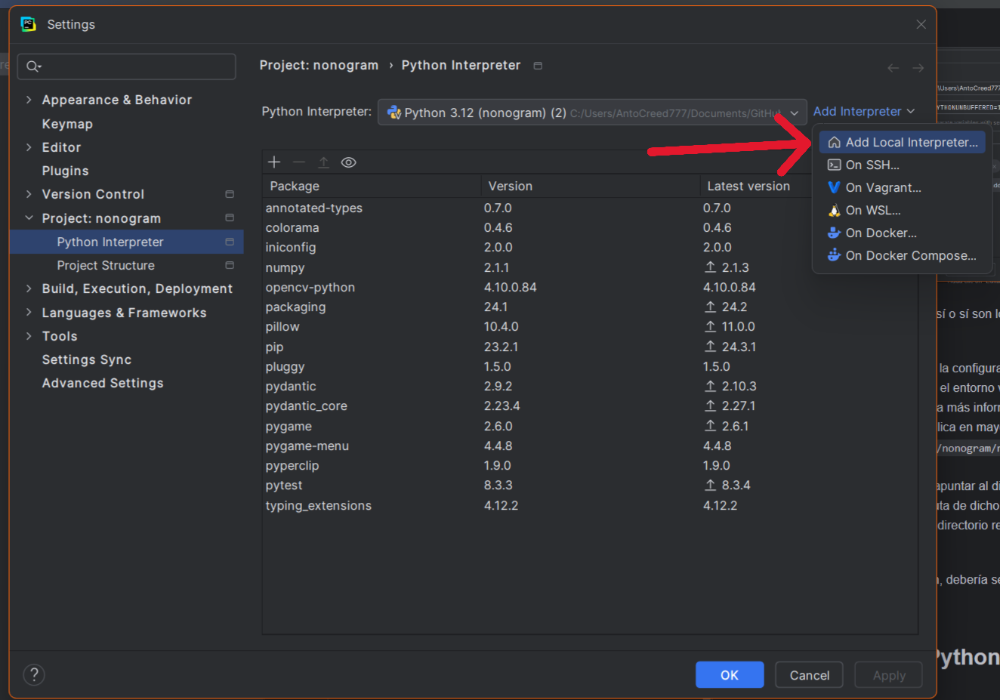
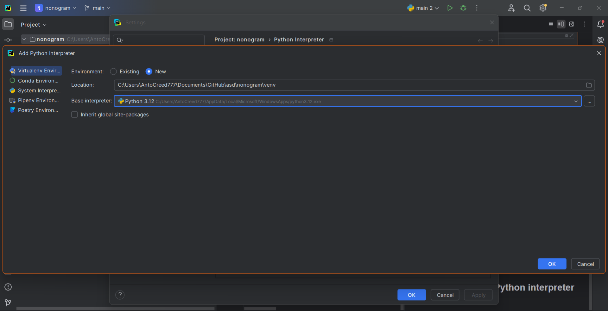
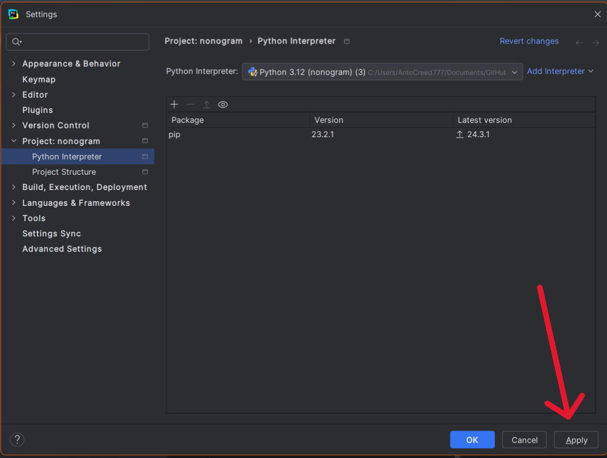
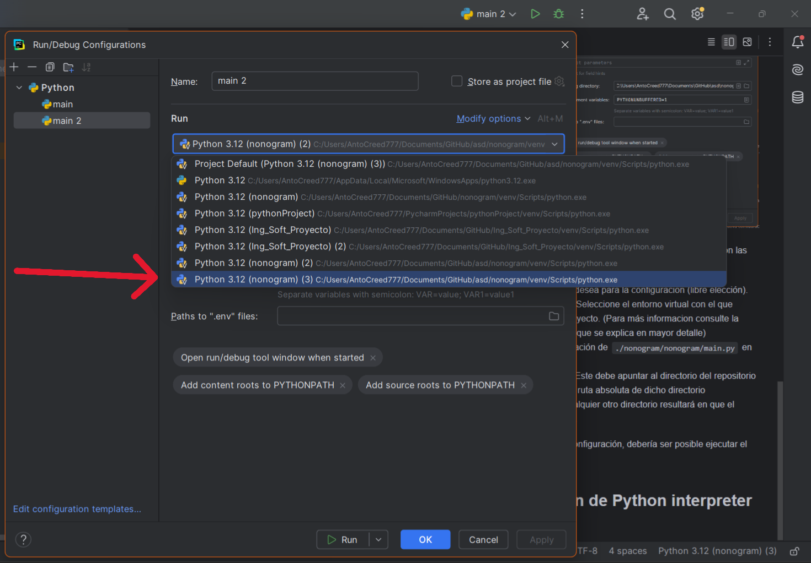

# Proyecto Nonogram

## Integrantes del grupo
- [Carlos Tomás Álvarez Norambuena](https://github.com/Karantooo)  **(2022433621)**
- [Antonio Jesús Benavides Puentes](https://github.com/AntoCreed777) **(2023455954)**
- [Javier Alejandro Campos Contreras](https://github.com/huebitoo) **(2023432857)**
- [Pablo Esteban Villagrán Hermanns](https://github.com/Pvilla14) **(2023439231)**

## Tecnologías utilizadas en el proyecto
<p align="center">
  <a href="https://skillicons.dev">
    
  </a>
</p>
<p align="center">
  <a href="https://skillicons.dev">
    
  </a>
</p>

## Instrucciones de instalación


### Sistemas operativos

**El sistema fue desarrollado en windows de principio a fin. Si bien en teoria no deberia haber problemas de compatibilidad en sistemas linux esta no fue testeado por lo que no aseguramos la misma.**

### Setup inicial
Clone el repositorio en un directorio de su elección. Abra la carpeta con PyCharm.  
Recomendamos crear un nuevo entorno virtual de Python con la versión 3.12.15. Consulte la [Configuración del intérprete de Python en PyCharm](#configuración-del-intérprete-de-python-en-pycharm) para más detalles.

Para instalar las dependencias, ejecute:  
```pip install -r requirements.txt```

Finalmente, **hay que cambiar el directorio de trabajo desde el que se ejecuta el proyecto**, de otra forma no se ejecutará.  
Para esto, vaya al menú de la esquina superior derecha de PyCharm (ver imagen).



Haga clic en "Editar configuraciones". Cree una nueva configuración de Python. Debería ver el siguiente menú:



Los campos que hay que completar sí o sí son los marcados con las flechas:

- **Name:** Nombre que desea para la configuración (libre elección).  
- **Python interpreter:** Seleccione el entorno virtual con el que desea ejecutar el proyecto. (Consulte la [Configuración del intérprete de Python en PyCharm](#configuración-del-intérprete-de-python-en-pycharm) para mayor detalle).
- **Script path:** La ubicación de `./nonogram/nonogram/main.py` en su computador.  
- **Working directory:** Este debe apuntar al directorio del repositorio clonado. Debe ser la ruta absoluta de dicho directorio (`../nonogram`). Cualquier otro directorio resultará en que el código no se ejecute.

Una vez realizada esta configuración, debería ser posible ejecutar el proyecto.



## Configuración del intérprete de Python en PyCharm

1. Diríjase al menú de configuraciones de PyCharm.


2. Diríjase al Menú de configuración de **Python Interpreter**.


3. Seleccione la opcion de agregar un **nuevo Interprete local**.


4. Seleccione las siguientes opciones:
    - **New Environment**.
    - La opción predeterminada en **Location**.
    - El intérprete base de Python instalado en su sistema. Si no lo tiene, consulte cómo instalarlo.
    - Presione **OK**.



5. Aplique los cambios. El intérprete que creó estará ya seleccionado.


6. Seleccione este intérprete en la configuración de `Run/Debug Configurations` mencionada en la  [seccion anterior](#setup-inicial).


<p align="center" style="margin-top: 20px; font-size: 18px;">
  <strong>¡Listo! Ahora debería ser posible ejecutar el proyecto.</strong>
</p>
